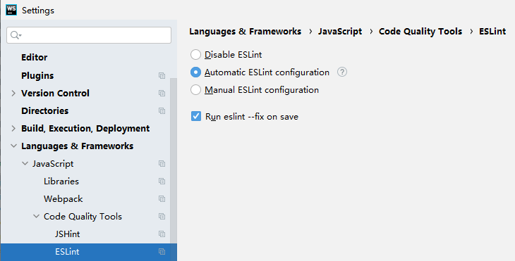

# 代码检查

> 前端程序猿！的代码风格养成 - 鲁迅

## ESLint 代码质量

ESLint是一个用来识别 ECMAScript 并且按照规则给出报告的代码检测工具，使用它可以避免低级错误和统一代码的风格。

idea配置ESLint



## Prettier 代码风格

```
# 句末分号
semi: false
# 使用单引号
singleQuote: true
printWidth: 80
tabWidth: 2
useTabs: false
endOfLine: lf
# 尾后逗号 es5默认 none不加逗号
trailingComma: es5
```